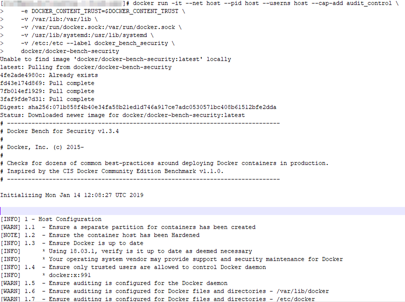
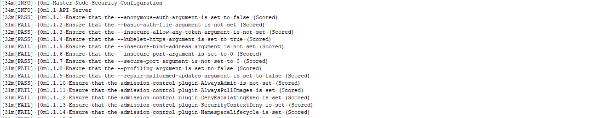
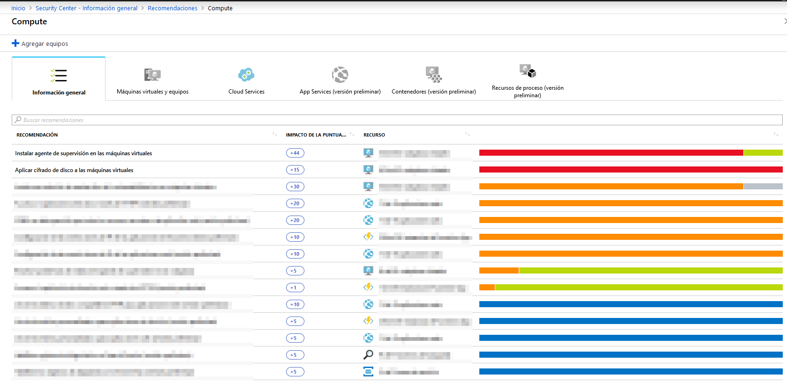
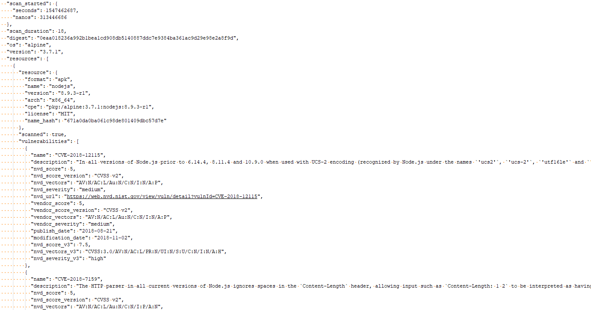
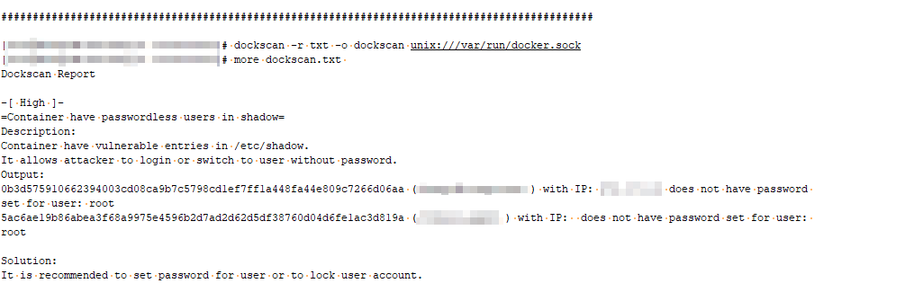
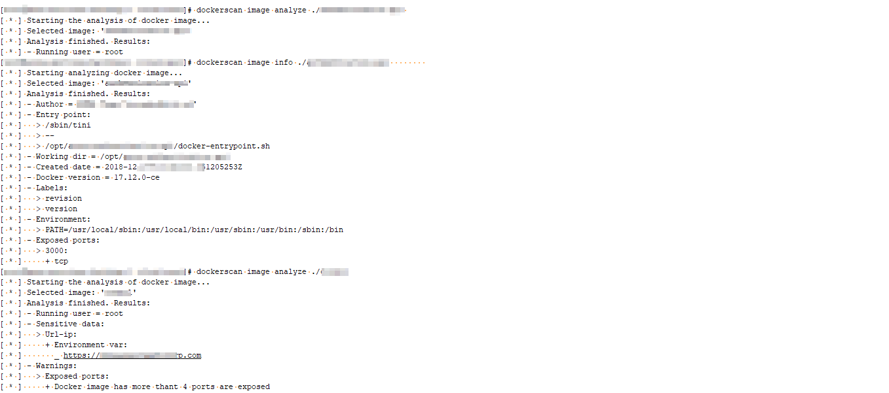

# DevSecOps Tools
Recopilación de herramientas complementarias para auditoría de Docker, K8, AWS, etc. 

Estas herramientas me han sido útiles en pentesting (tanto caja negra como blanca) y en la revisión de la seguridad de diferentes entornos y diferentes tecnologías.

---

## Índice

- [DevSecOps Tools](#devsecops-tools)
  - [Índice](#%C3%ADndice)
  - [Cumplimiento CIS](#cumplimiento-cis)
    - [AWS CIS](#aws-cis)
      - [Prowler](#prowler)
      - [AWS Inspector](#aws-inspector)
    - [Azure CIS](#azure-cis)
    - [Docker CIS](#docker-cis)
      - [Docker Bench for Security](#docker-bench-for-security)
    - [Kubernetes CIS](#kubernetes-cis)
      - [Kube Bench](#kube-bench)
  - [Vulnerabilidades](#vulnerabilidades)
    - [AWS Vulnerabilidades](#aws-vulnerabilidades)
    - [Azure Vulnerabilidades](#azure-vulnerabilidades)
    - [Docker Vulnerabilidades](#docker-vulnerabilidades)
      - [Aquasec Microscanner Wrapper](#aquasec-microscanner-wrapper)
      - [DockScan](#dockscan)
      - [Docker Scan](#docker-scan)

---

## Cumplimiento CIS

### AWS CIS

#### [Prowler](https://github.com/toniblyx/prowler)

Es una herramienta en python que permite realizar un análisis del grado de cumplimiento con el bastionado CIS de el entorno en AWS además de diferentes grupos de checks predefinidos relacionados con el control IAM, monitorización, logging, forense entre otros.

Permite exportar los resultados en múltiples formatos (CSV, JSON, TXT, etc.)


#### [AWS Inspector](http://console.aws.amazon.com/inspector/)

Herramienta que permite realizar análisis de vulnerabilidades, cumplimiento CIS, nivel de exposición desde internet, etc. en las instancias virtuales de AWS. Trae implementado por defecto cinco tipos de escaneos: Runtime Behavior Analysis, Security Best Practices, Network Reachability, CIS Operating System Security Configuration Benchmarks (no están soportados todos los S.O.) y Common Vulnerabilities and Exposures aunque también se pueden crear plantillas de análisis personalizadas.

Para ejecutarlo hay que instalar el agente de Inspector en las máquinas virtuales y usando la propia interfaz web de la herramienta definir un "Objetivo de Evaluación" indicando el conjunto de instancias virtuales sobre las que realizar el análisis, definir la "Plantilla de Evaluación" para indicar el/los tipo/s de análisis a correr y una "Ejecución" en donde se puede lanzar manualmente o programar una tarea periódica para que se realice automáticamente.

En la sección "Hallazgos" están los resultados de los análisis ejecutados.


### Azure CIS

Aunque el benchmark CIS de Azure está definido y es posible encontrar y descargasr los benchmarks en diferentes formatos no he localizado ninguna herramienta que lo tenga incorporado, ni siquiera está en Nessus.


Es posible obtener este grado de cumplimiento a través de la herramienta "Security Center" integrada en la propia suscripción de Azure la cual además muestra el estado referente al cumplimiento PCI DSS, ISO 27001 y SOC TSP.


Para obtenerlo, no basta solo con activar el Security Center e instalar los agentes de monitorización en todos los nodos sino que hay que hacer uso de la versión "Standard" (de pago). Lo bueno que Microsoft deja un mes de prueba gratis para esta versión completa de Security Center y una vez lo tengamos es posible volverlo a desactivar.


### Docker CIS

#### [Docker Bench for Security](https://github.com/docker/docker-bench-security)

Este script comprueba automáticamente las buenas prácticas en el despligue de Dockers inspirado en el CIS Docker Community Edition Benchmark v1.1.0.

La manera más sencilla de correr esta herramienta es haciendo uso del contenedor ya definido por ellos el cual se puede correr en el host que queramos comprobar. Antes de ello hay que ajustar los volúmenes a compartir con el Docker para ajustarlos según el S.O. que se vaya a auditar.

```bash
docker run -it --net host --pid host --userns host --cap-add audit_control \
    -e DOCKER_CONTENT_TRUST=$DOCKER_CONTENT_TRUST \
    -v /var/lib:/var/lib \
    -v /var/run/docker.sock:/var/run/docker.sock \
    -v /usr/lib/systemd:/usr/lib/systemd \
    -v /etc:/etc --label docker_bench_security \
    docker/docker-bench-security
```


### Kubernetes CIS

#### [Kube Bench](https://github.com/aquasecurity/kube-bench)

Para determinar el grado de cumplimiento CIS para Kubernetes se puede utilizar la herramienta kube-bench desarrollada en Go la cual realiza una comprobación de los checks definidos en CIS Kubernetes Benchmark aunque también permite añadir test personalizados a través de ficheros de configuración YAML.

Esta herramienta soporta test para múltiples versiones de Kubernetes (1.6, 1.7, 1.8, and 1.11) definidas en las guías CIS 1.0.0, 1.1.0, 1.2.0, y 1.3.0 respectivamente.

La forma más sencilla de ejecutar esta herramienta es ejecutarlo desde un contenedor y lanzar las pruebas sobre el clúster de K8.

```bash
docker run --pid=host -v /etc:/etc:ro -v /var:/var:ro -t aquasec/kube-bench:latest <master|node>
```

Es posible también lanzarlo sobre un clúster de Kubernetes o sobre un POD en concreto indicándolo a través de los archivos YAML job-master y job-node proporcionados.

```bash
$ kubectl apply -f job-master.yaml 
job.batch/kube-bench-master created

$ kubectl get pods
NAME                      READY   STATUS              RESTARTS   AGE
kube-bench-master-j76s9   0/1     ContainerCreating   0          3s

# Wait for a few seconds for the job to complete
$ kubectl get pods
NAME                      READY   STATUS      RESTARTS   AGE
kube-bench-master-j76s9   0/1     Completed   0          11s

# The results are held in the pod's logs
k logs kube-bench-master-j76s9
[INFO] 1 Master Node Security Configuration
[INFO] 1.1 API Server
...
```


## Vulnerabilidades

### AWS Vulnerabilidades

En este caso, se puede utilizar directamente uno de los tipos de escáneres definidios en [AWS Inspector](#aws-inspector) específico para ello.

### Azure Vulnerabilidades

Para el análisis de las vulnerabilidades de los diferentes componentes desplegados en Azure es posible obtenerlas a través del Security Center [Azure CIS](#azure-cis).



### Docker Vulnerabilidades

#### [Aquasec Microscanner Wrapper](https://github.com/lukebond/microscanner-wrapper)

Esta herramienta permite analizar las imágenes creadas o utilizadas en Docker para obtener un listado de vulnerabilidades conocidas que hay en los componentes que integran.

Tras registrar un token hay que pasárselo a la herramienta en una variable de entorno y directamente lanzarla contra la imagen que queremos analizar. Permite obtener la salida en formato JSON o HTML.

```bash
$ MICROSCANNER_TOKEN=xxxxxxxxxxxxxxxx ./scan.sh aquasec/microscanner
```


#### [DockScan](https://github.com/kost/dockscan)

Esta herramienta está desarrollada en Ruby.

```
gem install dockscan
```

A continuación se muestran algunos ejemplos típicos de uso de la herramienta.

Para realizar un escaneo local de la instalación de Docker
``` bash
dockscan unix:///var/run/docker.sock
```

Para realizar un escaneo remoto y guardar la salida en formato HTML
```bash
dockscan -r html -o myreport -v tcp://example.com:5422
```

Para realizar un escaneo remoto y guardar la salida en formato TXT
```bash
dockscan -r txt -o myreport -v tcp://example.com:5422
```



#### [Docker Scan](https://github.com/cr0hn/dockerscan)

Esta herramienta en python permite escanear una red para tratar de localizar Docker Registries para tratar de obtener información, borrar imágenes o subir las nuestras propias y además permite analizar imágenes para buscar información sensible o tratar de modificarlas para inyectar por ejemplo una shell reversa en ellas.

