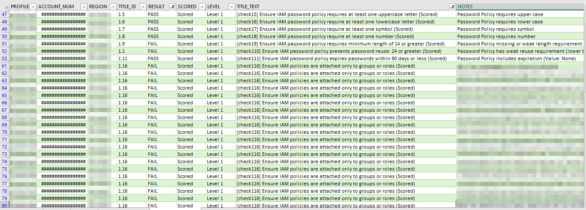
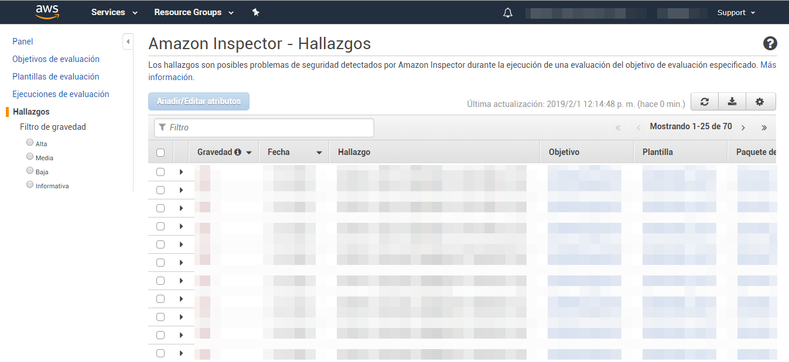

# DevSecOps Tools
Recopilación de herramientas para auditoría de Docker, K8, AWS ...

---

## Herramientas para determinar el estado de cumplimiento CIS

### AWS

#### [**_Prowler_**](https://github.com/toniblyx/prowler)

Es una herramienta en python que permite realizar un análisis del grado de cumplimiento con el bastionado CIS de el entorno en AWS además de diferentes grupos de checks predefinidos relacionados con el control IAM, monitorización, logging, forense ...

Permite exportar los resultados en múltiples formatos (CSV, JSON, TXT ...)

#### [**_AWS Inspector_**](http://console.aws.amazon.com/inspector/)

Es otra herramienta que trae implementado por defecto cinco tipos de escaneos por defecto: Runtime Behavior Analysis, Security Best Practices, Network Reachability, CIS Operating System Security Configuration Benchmarks (no están soportados todos los S.O.) y Common Vulnerabilities and Exposures. También se pueden crear plantillas de análisis personalizadas.

Para ejecutarlo hay que instalar el agente de Inspector en las máquinas virtuales y usando la propia interfaz web de la herramienta definir un "Objetivo de Evaluación" indicando el conjunto de instancias virtuales sobre las que realizar el análisis, definir la "Plantilla de Evaluación" para indicar el/los tipo/s de análisis a correr y una "Ejecución" en donde se puede lanzar manualmente o programar una tarea periódica para que se realice automáticamente.

En la sección "Hallazgos" están los resultados de los análisis ejecutados.

### Azure

### Docker

### Kubernetes